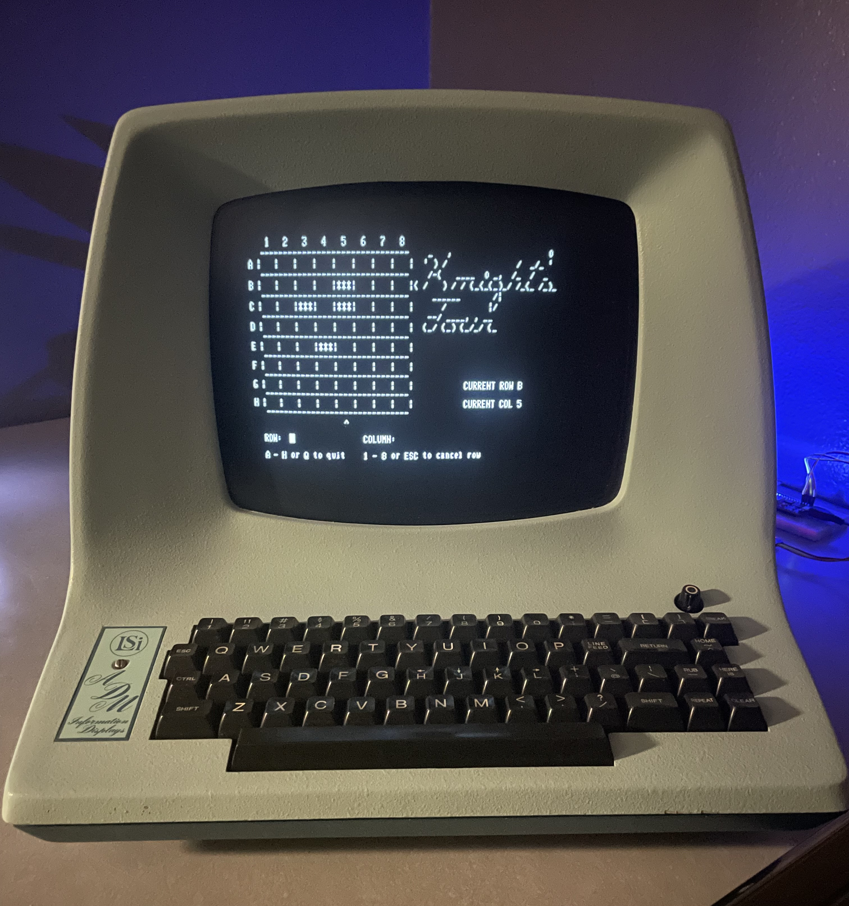
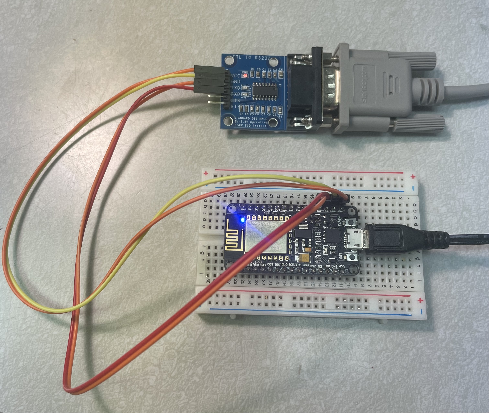

# HITERM

HITERM is a telnet client for your serial terminal.

It runs on ESP8266 devices (NodeMCU, etc.) to connect the terminal to wifi.  

If you happen to be using a Lear Siegler ADM-3A "dumb" terminal, HITERM can convert DEC ANSI sequences to the primitive cursor control commands understood by the terminal. This allows your terminal to run a lot of programs it otherwise would not be able to. For example, Dope Wars on sdf.org, z-machine based text adventures, irssi (IRC) and many other ncurses programs.  



If I ever find a Soroc IQ-120, I'd like to add the ANSI support to it as well.  


### QUICK START

1. Load hiterm.ino in the Arduino IDE
2. Select your ESP8266 board in Boards Manager
3. Compile and upload to your board
4. Use a TTL to RS232 converter to connect the ESP8266 to your terminal
5. Set terminal to 1200 baud
6. Boot the ESP8266

```
hiterm> wifi
SSID: <YOUR SSID>
Passphrase: <YOUR PASSPHRASE>
hiterm> restart
```
```
hiterm> set term vt100
hiterm> open telehack.com
```

#### Recommended

Change the baud rate to the highest value supported by your terminal:  
```
hiterm> set baud 19200
hiterm> restart
```

Set your terminal to use the same baud rate and then restart the ESP8266.  


#### Notes

 * The TTL to RS232 module is cheap on Amazon, just look for one with a DB9 connecter and six serial pins. Plug the serial cable from your terminal into the DB9 connecter (get a DB25 to DB9 adapter if you need one) and then connect VCC, GND, TXD, RXD pins to your ESP8266 board (TXD -> RXD, RXD -> TXD) and you're all set.
 * Make sure the terminal you specify in the "set term" command is found in the TERMINFO database because HITERM will send this name to the host you are connecting to using the telnet protocol. You can verify you have the correct name using the *infocmp* command on Linux, for example: *infocmp adm3a*




 #### Lear Siegler ADM-3A

 Try the DEC ANSI emulator to make your ADM-3A work like a VT100:  
 ```
 hiterm> set term adm3a-ansi
 hiterm> open telehack.com
 .zrun aquarium
```
Note that this is DEC ANSI not BBS ANSI.  
